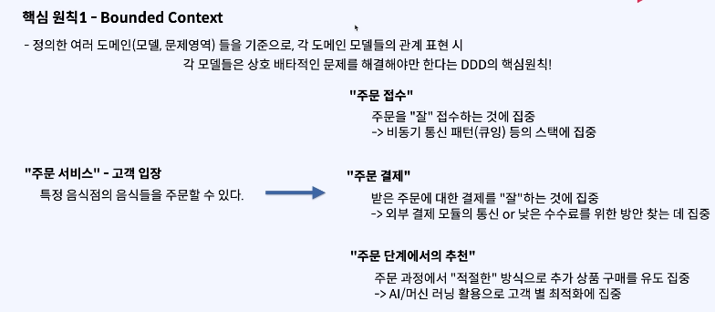

# 도메인 주도 패턴 (DDD)

### 도메인 주도 설계

- 하나의 소프트웨어 개발 방법론 으로, 복잡한 도메인을 이해하고 해결 하는데에 목적이 있고 이에 집중하는 방법론
    - 도메인이 복잡해지면서 생기는 문제들이 아키텍처를 엉망으로 만드는 경우가 많았고, 결과적으로 유지보수를 어렵게 만드는 경우가 많았어
    - DDD 는 이를 해결하기 위한 하나의 방법론(이론) 이다.

> 갑자기, 서비스를 식별하는 과정에 있어서 개발 방법론 ?
>  - -> 직접적인 관계가 있는 것은 아니지만, 해당 방법론 내에 다양한 이론들이 높은 Business Capability 를 가질 수 있는 서비스 식별에 큰 도움이 될 수 있다.

#### 결론.

- DDD 의 핵심 개념/원칙 들은 MSA 의 핵심 개념이였던 개별 팀이 Product 로서 서비스를 소유한다는 사고방식과 일치한다 !

### 핵심 개념/원칙

- 유비쿼터스 언어 (공통 언어)
- 도메인 모델
- 경계 컨텍스트 (Bounded Context)
- 하위 도메인 (Sub-Domain)

### 유비쿼터스 언어

- 복잡한 도메인을 이해하고 해결하기 위한 팀(해결을 위해 모인 집단) 이 공통으로 쓰기 위한 언어들의 약속

> Q: 복잡한 도메인 해결을 위해서 어떻게 해야할까 ?
> - > 도메인 전문가 (e.g) 은행법 전문가, 배달 노동자 관련 노무 전문가, 전자 상거래 관련 전문가
    > Q: 도메인 전문가는 소프트웨어 개발을 할 수 있을까 ?
> - > 일반적으로는 불가능 하다.
    > Q: 그러면, 소프트웨어 엔지니어와 도메인 전문가는 같이 일을 해야겠네 ? 소통이 중요할것 같아 어떻게 해결해?
> - > 그래서 나온 개념이 유비 쿼터스 랭귀지

- > 개발자와 비개발자가 문제 를 해결하기 위해 사용할 언어들의 의미에 대한 약속 모음.

### 도메인 주도 설계 (DDD, Domain-Driven Design)

- 도메인 모델 이란 ?
    - 유비쿼터스 언어를 사용하여, 비즈니스 요구사항을 만족하기 위해서 표현하기 위해 `도메인들의 핵심 개념과 규칙을 표현하는 객체들의 관계` 로 구성

### 배달 앱을 비즈니스 동작 대로 식별한다면

- `주문 관리 도메인`
- `음식 관리 도메인`
- `배달 도메인`

> 하지만, 그저 이렇게 도메인을 식별하기만 해서는 도메인 모델을 그리는 의미와 목적이 부족할 수 있다.

### 이론

- 엔티티 (Entity): 하나의 객체를 의미하며, 하나의 테이블 모델로서 존재할 수 있는 데이터들의 묶음
- 어그리거트 (Aggregat): 데이터 변경의 단위로 다루는 연관된 엔티티들의 묶음 (관련된 객체들의 집합)
- 어그리거트 루트 (Aggregate Root): 어그리거트(집합) 에서 도메인의 중심을 의미하는 엔티티를 의미

### 도메인 모델

- 도메인을 이해하는 것이 도메인 모델의 목적이다.
- 그리고 어그리거트 라는 개념이 수단으로서 사용되어진다.
- 모델 설계 시 도움일 뿐이며, 어그리거트를 기준으로 서비스가 식별되는것은 아니다.

### Bounded Context

- 정의한 여러 도메인(모델,문제영역) 들을 기준으로, 각 도메인 모델들의 관계 표현 시 각 모델들은 상호 베타적인 문제를 해결해야만 한다는 DDD 의 핵심원칙 !
- 정의한 도메인 모델들을 Bounded-Context 원칙에 따라, Business Capability 를 높일 수 있는 방식으로 분리해야 한다는 원칙
- 즉, 분명한 Bounded-Context 를 가지는 어그리거트 간의 관계와 각 어그리거트 별로 어그리거트 루트로 분리된 어그리거트는 하위 도메인이다.
- 하위 도메인 패턴에 의한 서비스 식별 이 핵심이다.

