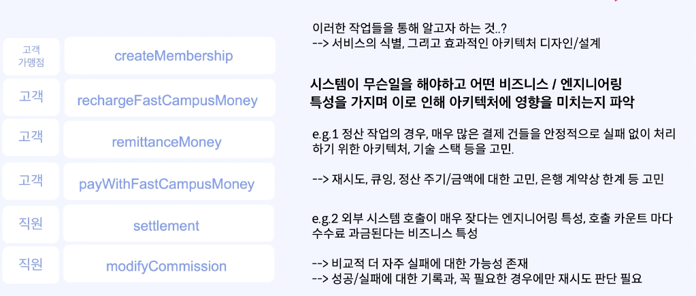

### MSA 아키텍처를 위한 Micro Service 를 식별하기 위해서
- 1 단계: 기능 요건 정의하기 (from 도메인 전문가)
  - 기능 요건이란, 시스템이 갖춰야 할 요건을 정의하는 것
  - 도메인 레벨에서, 해당 시스템은 어떤 것을 해야한다에 대한 요건들.
- 2 단계: 기능 요건으로부터 사용자(액터) 시나리오 케이스 정의하고 도메인 모델 도출
- 3 단계: 2단계 에서 도출한 시나리오를 만족하기 위해, 페이 라는 시스템이 해야할 작업 식별하기
- 4 단계: 식별된 작업을 기준으로, "도메인" 즉 "서비스" 를 정의하기.

> 고수준 : 사용자 기준

### 기능 요건 정의해보기
- 시스템이 갖춰야 할 요건을 정의하는것

시스템 에 참여하는 주체가 -> 고객으로써, / 페이 직원으로써/ 가맹점주로써

어떤 수단을 통해서 -> 외부 은행과 통신, 주기적인 정산 작업을 진행, 파라미터 변경

무엇을 이루고자 하는지 -> 머니충전 : 선불 충전 금액의 관리, 송금: 내가 소지한 돈의 이동, 가맹점 정산, 결제, 회계 시스템 연계

> 법과 제도를 알고, 간편 결제 시스템 도메인에 어느정도 알고 있다면 굳이 개발자나, 전문가 들이 아니더라도 기능요건을 정리 할 수 있다.

### 시스템 작업 정의하기 
- 회원가입, 가맹점 등록 -> (고객 가맹점 ) -> createMembership
- 페이머니 20,000 원을 충전해줘 -> ( 고객 ) -> rechargePayMoney 
- A 에게 송금해줘 -> ( 고객 ) -> remittanceMoney
- 땡땡 치킨에서 30,000 원을 결제해 줘 -> ( 고객 ) -> payWithMoney
- 정산을 통해 완료된 결제 건들을 처리해줘 -> ( 고객 ) -> settlement 
- 결제 수수료를 변경해줘 -> ( 고객 ) -> modifyCommission

### 결국, 시스템이 무슨 일을 해야 하는지를 정의

