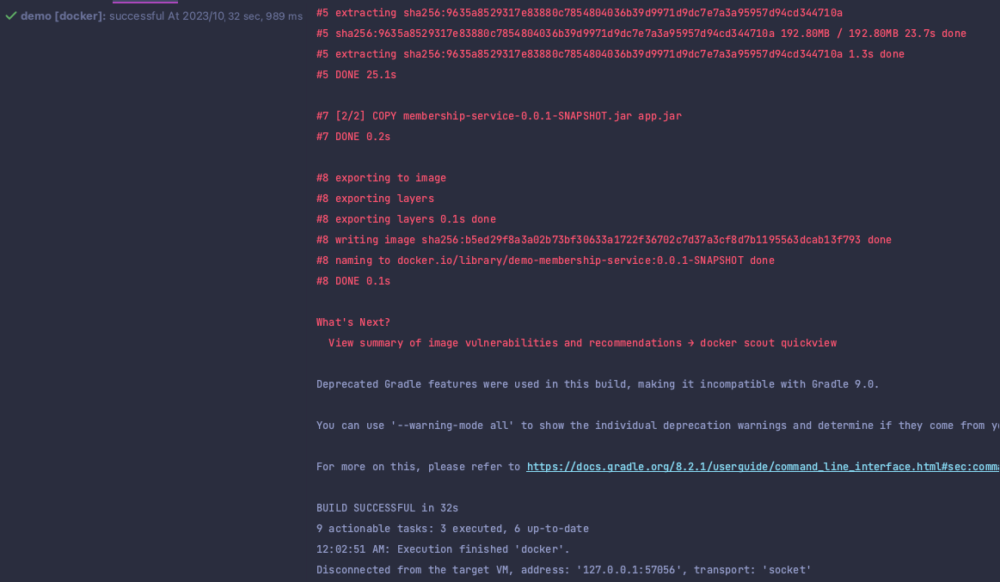
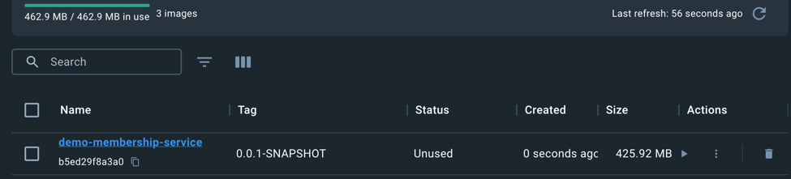

# Dockerizing

### 도커라이징 ?

- 어플리케이션을 docker build 를 통해 image 로 만드는 작업. (Containerizing)
- 일반적으로 dockerfile 이라는 파일에, image 를 빌드하는 일련의 작업을 정의.

#### 장점: 운영 체제와 하드웨어에 독립적 // 환경 일관성 // 격리성 // 빠른 배포와 롤백 가능

#### 단점: 러닝 커브 // docker 라는 추가적인 리소스 // 보안 이슈 // 이미지 크기 최적화가 어렵다.

### Dockerfile

```text
FROM openjdk:11-slim-stretch <- base Image 를 사용
EXPOSE 8080 <- 해당 port 를 오픈 시킬것이고
ARG JAR_FILE <- 아규먼트를 Jar File 로 받을꺼야
COPY ${JAR_FILE} app.jar <- 내부 컨테이너에 app.jar 로 저장을 해서 
ENTRYPOINT ["java", "-jar", "/app.jar"] <- 해당 이미지가 올라왔을 때 자바의 jar 이미지를 실행할 것이다.
```

### build.gradle

```text

plugins {
    id 'java'
    id 'org.springframework.boot' version '2.5.2'
    id 'io.spring.dependency-management' version '1.0.15.RELEASE'
    id 'com.palantir.docker' version '0.35.0' <- 해당 부분 버전 을 지정해주고 맨아래 로 가보자. 
}

... 기존 의존 등등등....

아래 docker 설정을 파해쳐 보자

docker {
    println(tasks.bootJar.outputs.files) <- 디버깅용
    name rootProject.name + '-' + project.name + ':' + version <- 이미지 이름
    dockerfile file('./Dockerfile') <- 어떤 도커파일 을 사용할껀지 
    files tasks.bootJar.outputs.files <- 어떤 파일들을 Dockerfile 에 복사할 것인가
    buildArgs(['JAR_FILE': tasks.bootJar.outputs.files.singleFile.name]) <- Dockerfile 에 전달할 인자
}

```

### plugins 에 id 'com.palantir.docker' version '0.35.0' 를 추가했다면

- 코끼리가 살고 싶다고 아이콘을 내민다. 눌러주자. ( 재 build )

### 실행해보자 build.gradle 에서

- docker { <- 해당 부분 좌측에 초록색 화살표를 살며시 눌러보자

### 빌드 성공





### 또는 terminal 에 아래 명령어 입력

- docker image ls | grep membership

