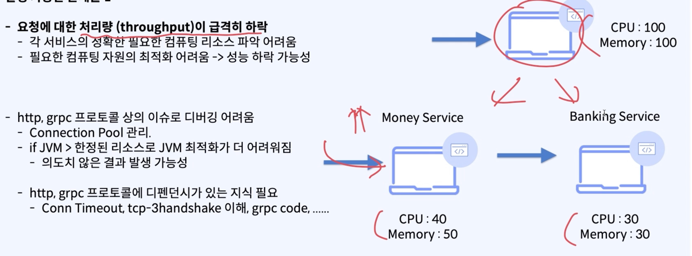
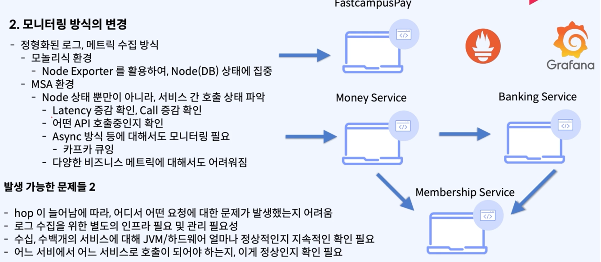

# 분해로 인해 달라질 수 있는 상황들

### 상황 1 (모놀리스) 에서 (MSA) 로 갔더니 ...
1. 모듈간 통신 -> 서비스 (프로세스) 간 통신
   2. method (Function Call) -> Network (http/grpc)
      - 서버간 (서비스간) 통신 을 하다보니 ... method 콜이 아니여서 문제가 발생해요
   - 요청에 대한 처리량 급격히 하락
   - 필요한 컴퓨팅 자원의 최적화 어려움
   - http / grpc 프로토콜 상의 이슈로 디버깅이 어려움
3. 닥쳐봐야 아는 이슈
   4. 컴퓨팅 자원 줄여놨더니 생각보다 서버 리소스 양이 높음.
      - ( 회사가 갑자기 잘될줄 누가 알겠누 )
      - 추가적으로 놀고있는 서버가 있을 수 있잖냐
      

> MSA 상황이 되면 개발자 입장에서 알아야 되는 지식이 늘어날 수 있다.

### 운영 유지보수 입장 에서의 문제

### 모니터링 방식의 변경
- hop 이 늘어남에 따라, 어디서 어떤 요청에 대한 문제가 발생했는지 어려움
  - 서비스의 갯수가 늘어가면서, 어느 요청에서 문제가 발생했는지 ?
- 로그 수집을 위한 별도의 인프라 필요 및 관리 필요성
  - 로깅 파이프라인
  - 굉장히 복잡하고, 처리해야할 많은 문제들 발생
  - 무엇이 우리 비즈니스에 올바른 것인지 + 오픈소스 비용은 어느정도 인지
    - 지속적인 모니터링 을 해줘야 하니...
- 어느 서비스에서 어느 서비스로 호출이 되어야 하는지, 이게 정상인지 확인 필요
  - 서비스 간 호출 상태가 옳은 상태인지, 엉뚱한 서비스를 호출하지는 않는지 파악 어려움

> 분리, 분해 로 인해 -> 개발자, 운영, 유지보수 인력도 힘들어져

