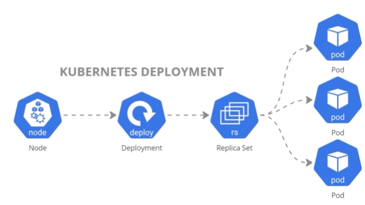
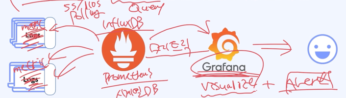

# 분해로 인해 생겼던 다양한 문제들 해결법

### 한정된 갯수의 서버와 서비스의 갯수
- 수 많은 서버들을 관리 + 배포 = Container ! ( Docker )
- 많은 컨테이너는 어떻게 관리 ? -> Container Ochestration ! (K8S)

> K8s, Docker(Containerizing) 을 이용한 컨테이너 오케스트레이션

# 분해도 인해 생겼던 다양한 문제들을 어떻게 해결하나요 ?
- hop 이 늘어남에 따라, 어디서 어떤 요청에 대한 문제가 발생했는지 어려워요
  - 서비스 갯수가 늘어가면서, 어느 요청에서 문제가 발생했는지 ? -> Tracing
- 로그 수집을 위한 별도의 인프라 필요 및 관리 필요성 -> Logging
  - 비교적 간단한 로깅 파이프라인
  - 굉장히 복잡하고, 처리해야할 많은 문제들 발생 
- 수십, 수백개의 서비스에 대해 JVM/하드웨어 얼마나 정상적인지 지속적인 확인 필요 -> Metric, Alert
  - 서비스 또는 서버에 문제가 생기더라도 적절하게 문제 감지 어려움
- 어느 서버에서 어느 서비스로 호출이 되어야 하는지, 이게 정상인지 확인 필요 -> Service-Mesh
  - 서비스 간 호출 상태가 옳은 상태인지, 엉뚱한 서비스를 호출하지는 않는지 파악 어려움 

> MSA 환경에서 Tracing, Logging, Metric,Alert , Service-Mesh 를 잘하고 있으면 모니터링을 잘하고 있다에 척도가 된다 

### 올바른 사용 예
- 특정 Metric 에 사전 정의 되어진 Alert 를 통해서 문제를 감지
- 어떤 Metric 에 대한 문제인지를 파악하고, 어떤 행동을 해야할 지 판단
  - Metric 수치를 보고 오판단, 혹은 당장 이슈의 정도가 미미하다면, Alert 조건 등을 수정 (코드 수정)
  - 어플리케이션 레벨의 문제라고 판단 시, Log 확인
  - 단순 로그로 확인이 어려울 시, 해당 트랜잭션에 대한 Tracing 확인
  - 인프라 수준의 문제라면, 정확한 원인 파악 필요 (CI/CD 과정 에서의 문제, OOM Killed 등)
  - 라우팅, 트래픽 등에 문제라면, Service-Mesh 를 통해 현재 서비스 간 트래픽 모니터링 상태 확인
- 같은 문제가 발생 하지 않도록 조치가 필요하다.

# 각 요소 별로 풀어야 할 문제들과, 이를 해결해 주는 여러 스택들

### Logging !
- 수 많은 서버 (IDC, Cloud) 내의, 수많은 서비스들의 로그들을 적절히 필터링 하여 누락 없이 로그 저장소까지 전송해야 한다.
- 수 많은 로그들을 적절히 인덱싱 하여, 필요 시 빠르게 다양한 조건으로 검색이 가능해야 한다.

### 로깅 파이프라인 정리
> 서버 서비스 단에 log 들 disk 에 쌓고 있을것이다.
> - 이것들을 LogStash, FluentBit, FluentD 제품군들이 원하늘 필터링 조건에 맞게 수집을 해줄것이고 
> - 일반적으로 Kafka 같은 queue 를 통해 elastic Search 에 도달을 시킬 것이고
> - elastic 은 받은 로그들을 검색하기 쉬운 형태로 indexing 을 해줄 것이고 
> - kibana 를 통해서 해당 로그들을 검색할 수 있게 끔 해준다 (개발자가 보는 영역)

### 메트릭과 얼럿 (Metric, Alert) !
- 수많은 서버 (IDC, Cloud) 내에, 수많은 서비스 내 메트릭 들을 안정적으로 수집하고, 시계열 DB 방식으로 저장해야 한다.
  - 시계열 DB 란 시간의 흐름에 따라서 데이터를 조회할 수 있는 것에 최적화된 저장 방식을 가진 데이터 베이스 이다.
  - 많은 오픈소스가 있고, 대시보드를 사용해야 한다.
- 원하는 복잡한 형태의 비즈니스 메트릭을 작성하고, 이를 기반으로 적절하게 Alert 조건을 설정할 수 있어야 한다.

> 프로메테우스 혹은 인플럭스DB 가 시계열 DB 이다.
> - 이런 시계열 DB 를 예쁘게 대시보드화 시켜주는게 Grafana (그라파나) 이다.
> - 그라파나는 only Visualize + alert 를 내장하고 있는게 그라파나 이다.

> 프로메테우스는 각각 서버에 들어가 있는 메트릭들을 가져온다 
> - 너네 지금 메트릭 어떄 ? 어떄 ? polling 방식으로 초단위 마다 pull 방식으로 물어본다
> - 메트릭을 쌓는 서버 입장에서 땡겨지는 방식인거지
> - pull 방식을 지원하지 않는 특정 오픈소스 들이 있는데 push 방식도 있다.
> - 그러나 기본적으로 pull 방식이어야 한다 왜냐면 메트릭을 수집하는 동작의 주체는 프로메테우스 여야 하기 때문에
> - 쌓는 입장에서는 (일하는 아이) 안그래도 쌓기 바쁜데, push 까지 하면 개오바잖아.
> - 각각이 하는 일들에 concern (내가 집중하는 것)

### 트레이싱 (Tracing)
- 하나의 소스 (트랜잭션) 에 대해서, 여러개의 서비스에서 어떤 과정들을 거처 수행되었는지 확인해야한다.
  - 절절한 샘플링과, 보기 좋은 UI 등을 제공해야해

> 구현하는 툴은 대표 3 대장 이 있는데
> - 예거, 집킨, 템포 가 존재한다.
> - 템포는 그라파나 쪽에서 나온친구, 에거는 Go 언어로 만든 트레이싱 툴이다.

> 이것들의 역할은 사실상 로그나, 메트릭과 비슷할수 있다.
> 각각 의 서버 내부에서 돌아가는 코드들로 인해 쌓이는 트레이싱 정보가 있다.
> 어느 서버의 어느 분기를 통해 비즈니스 로직을 탔네 ? 하나의 Request Scope 에 의해 대해서 하위의 정보들을 잘 보여주는게 트레이싱이다.
> Span <- 이라는 개념 공부 필요.

#### 결과 적으로 어떤 상황에 어떤 통신 패턴 (IPC, Inter Process Communication Pattern) 을 활용할지 고민해 봐야 한다.