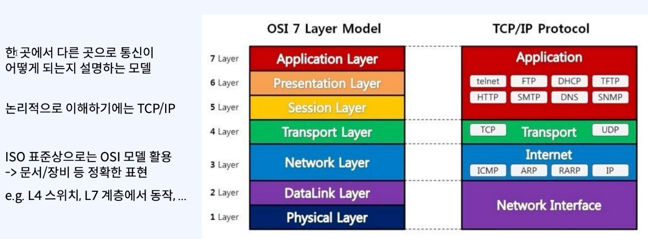
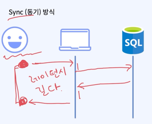
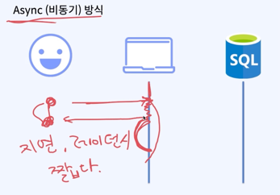
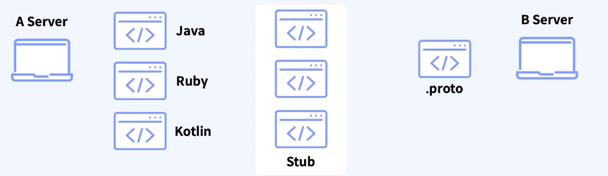
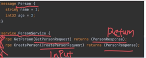

# IPC 를 위한 패턴

- IPC : Inter Process Communication
- "프로세스간 통신" -> "서비스간 통신" -> "MSA"

### 잠깐 네트워크 먼저 뚫고 가자

Network 통신이 어떻게 이루어지는지 이해가 필요

- OSI 7계층 (Open Systems Interconnection), TCP/IP 모델

## 둘다 한곳에서 다른곳으로 통신이 어떻게 되는지 설명하는 모델이다.

> 사람이 보는 눈에 입장에서 네트워크 통신을 하기 위한 어떤 동작을 수행했다고 보자.
> 제출하기, 회원가입하기 등등 뭐든간에 `특정 사용자` 의 클릭 부터 통신 과정을 설명하기 위한 모델이다.

> TCP 는 3 hand shake 를 구현하는 transport Layer 의 프로토콜 이며, 다시 이것을 사용해서 어플리케이션 계층에서 구현한 프로토콜이 HTTP 다.
> - 일반적으로 L7 L4 라는 이야기를 많이 쓰며, TCP 를 사용하는게 HTTP 다.
> - 통신 이라는것은 OSI 7 Layer -> TCP/IP 프로토콜 순으로 이루어 진다.

### 다시 돌아와 IPC 를 위한 패턴을 보자.

일반적인 IPC 는 크게 2가지로 나뉜다.

- 동기 방식 Sync
    - 
    - RestFul 방식 : HTTP, gRPC 방식을 많이 활용
    - 적절한 경우
        - 굉장히 중요한 작업을 하는 경우
        - 비교적 빠른 작업에 대한 요청일 경우
        - 선행작업이 필수적인 비즈니스인 경우
- 비동기 방식 Async
    - 
    - Queue 를 활용하여 Produce, Consume 방식으로 데이터 통신을 한다.
    - 예를들어, rabbitmq, kafka, pubsub 등
    - 적절한 경우
        - 매우 복잡하고 리소스 소모가 많은 작업의 요청일 경우
        - 비교적 한정된 컴퓨팅 리소스를 가지고 있는경우
            - 그런데, 서버 리소스로 인해 누락이 되면 안되는 경우
        - 독립적으로 실행되는 수 많은 서비스 들이 있는 대용량 MSA 환경
            - 응답 대기시간을 최소화
            - 느슨하게 결합도를 낮춰, 개별 서비스의 확장성을 유연하게 처리
            - 각 서비스에 문제가 생겼더라도, 복구 시에는 데이터 안정적으로 처리 가능
          > 많은 트래픽들을 다 받진 못해 그러나, 누락되면 안되 = 큐잉 방식
          > 서로가 서로를 직접 통신하면 느슨 하지 않다 ( 결합도 )
          > 느슨한 결합도를 위해 Event Bus 를 사용한다.

### 일반적인 Sync IPC 패턴 1 - HTTP

- OSI 7 응용 계층의 통신 프로토콜로써, L4 계층에서는 tcp 방식을 활용하는 프로토콜
- 여러가지 종류의 메서드가 존재하지만 일반적으로 4개의 메서드를 활용한다. (CRUD)
    - GET
        - 리소스를 얻어오기 위한 메서드 (READ)
    - POST
        - 리소스를 변경 (생성) 하기 위한 메서드 (CREATE)
    - PUT
        - 리소스를 변경 (생성된 리소스를 변경) 하기 위한 메서드 (UPDATE)
        - 멱등성 (idempotence) 필수
    - DELETE
        - 리소스를 삭제하기 위한 메서드 (DELETE)

### 일반적인 Sync IPC 패턴 2 - gRPC

- gRPC (google Remote Procedure Call)
    - Protocol Buffer 라는 것을 기반으로 하는 원격 프로시저 호출 프레임워크 에요.
    - 일반적으로 Server to Server Call 경우에 한해서 사용해요.
    - 정확히 특정 계층의 프로토콜 이라고 하기는 어려워 (L4 ~ L7)
    - 빠르지만, 번거로운 작업들과 위험이 수반된다.

> proto 라는 파일 : 서버와 서버간에 어떤 데이터를 가지고 호출할것인지를 약속하는 그 Spec 을 Proto 라고 한다.
> - gRPC 를 호출한다 라고 하는것은 proto 파일을 사전에 이미 정의를 했어 라는 것이고,
> - 호출 받는 서버 입장에서 아래 proto 파일을 가지고 각 언어별로 complie 해서 stub 이라는 것을 만들어 줘야한다.
> - 그리고 해당 stub 을 이용해서 A 라는 서버의 프로시저를 call 할 수 있는 환경을 만들어 줄 수 있다.

