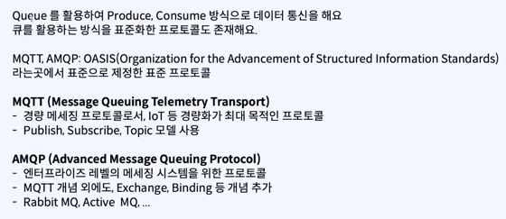
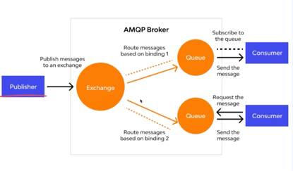
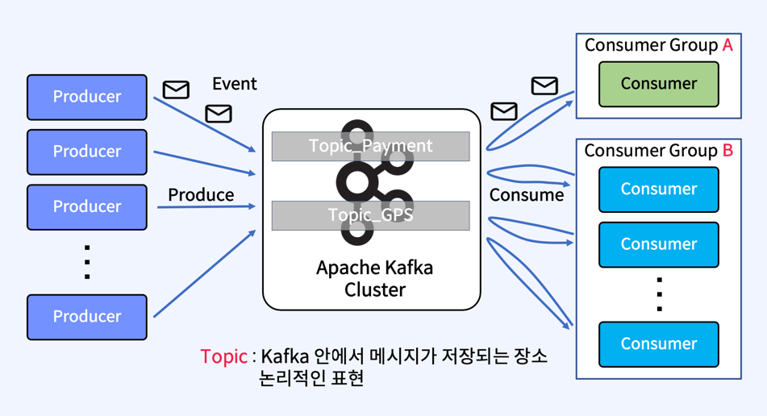
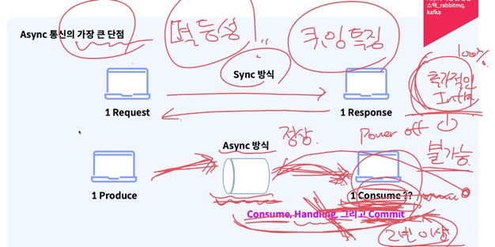

# Async 방식

### AMQP (Advanced Message Queuing Protocol) 의 구성요소
- 발행자는 Exchange 만 바라봄
- Exchange 는 Routing 역할
- Queue - Consumer
- -> Subscribe
- -> Request To message Sending

> 그림 설명
> - Publisher 메세지를 발행하는 입장 에서는 다 모르겠고 exchange 만 알아
> - Exchange 가 어디 큐로 메세지를 보낼꺼야 에서 "어디" 를 정하는게 binding 이라는 작업
> - publisher 는 Exchange 에 메세지를 발행하고, queue 는 메세지를 받을 수 있는 객체이며, 그 각각의 큐 들은 
> - Exchange 와 binding 을 통해서만 그 메세지를 받을 수 있는 환경이 될 것이고 
> - 해당 Queue 즉, 바인딩 되어서 들어온 메세지는 Consumer 를 통해서 만이 메세지가 소비된다.
>  그리고, consumer 입장에서 메세지를 받을수 있는 방식은 pull 과 push 두가지 방식이 있다.

### 드디어 배우는 카프카
- Kafka는 링크드인에서 개발한 대용량의 데이터 스트림을 처리하기 위한 분산 스트리딩 플랫폼이다.
- MQTT,AMQP 등의 표준을 구현하는 프로토콜이 아닌, 독립적인 데이터 스트리밍 플랫폼.

- 비교적 복잡한 개념들을 가지고 있지만, 성능(메세지 처리량)은 압도적이다.
- 고성능, 고용량 메세지 처리를 위해 설계되었다.
- 많은 회사에서, 그리고 JVM과의 좋은 궁합으로 상당히 폭넓게 사용되어지고 있어요 다만, 제대로 사용을 하기 위한 러닝 커브는 꽤 높은 편.

### Kafka 의 구성요소

- Topic: Producer, Consumer 의 메세징 객체
- Partition: Topic 을 물리적으로 분활하고 처리
- Broker: Kafka 클러스터의 각 노드의 의미
- Zookeeper: Kafka 클러스터의 메타데이터 관리

> 여담으로 linked 인에서 근무하는 (Jay Kreps) 가 상사의 지시를 받아 하루에 구직하는 사람들의 이벤트 스트림을 보고싶어서 만든게 카프카임.
> - 그리고 회사나와서 회사차림 confluent 라는 회사다.

### Async 통신의 가장 큰 단점

- 이를 보완해주는 수단은 멱등성 이다.