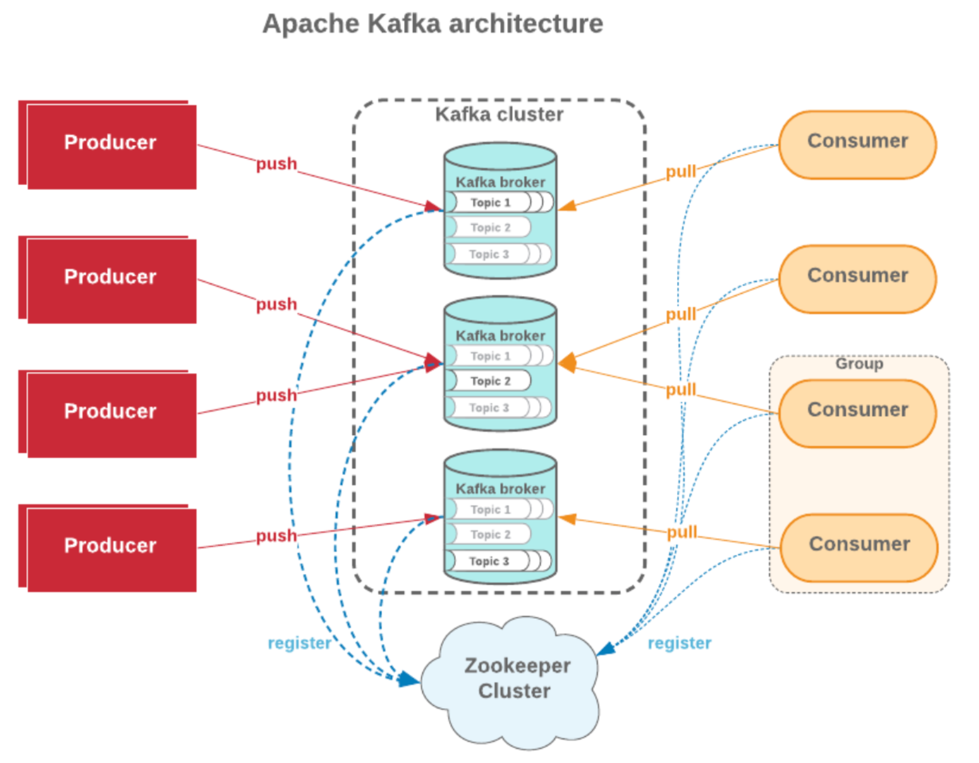

### 왜 카프카 를 써야할까 ?
- 실시간 이벤트 스프티밍 플랫폼 !
  - 태생 자체가 실시간성 처리 문제 떄문에 고안됨.
  - 고 가용성, 고성능
    - 기존의 Sync 방식을 대체 가능 할 수도 있는 수단
- 일반적으로 규모가 작은 비즈니스에서는 비적합하다.

> 일단 넣어놓고 나중에처리 ! 이런상황에서는 비적합
> - 거의 실시간 에 가깝게 처리해야 하는 경우에 적합하다.

대규모의 실시간 이벤트/데이터 스트리밍이 필요한 비즈니스에 적합
-> 트위터, 카카오, 넷플릭스, 우버 등...

대규모 실시간 이벤트를 지원핟다는것 -> 소규모도 당연히 지원 -> 모두쓰면 되는거 아님? 
- 적합하지 않을 수 있다 라는건 오버스펙이다.
- High Engineering Learning Curbe, Kafka 전문 인력 필요.

> 우리는 대규모 시스템 운영할 예정이니까 !

### 카프카의 기본 개념
- Producer
  - 메세지를 발행 하는 주체
  - Producer: 메세지를 발행하는 동작
- Consumer
  - 메세지를 소비 하는 주체
  - Consume: 메세지를 가져와서 처리하는 동작
- Consumer Group
  - 메세지를 소비 하는 "주체 집단"

### 좀더 쉽게 풀어내 보자. 
- Producer 라는건
- Kafka Cluster 내에 Topic 이 포함된 Kafka Broker 에 메세지를 발행하는 주체.
- Produce: 메세지를 Kafka Broker 내 Topic 에 발행 하는 동작.

- Consumer
- Kafka Cluster 내 Topic 이 포함된 Kafka Broker 로 부터 메세지를 소비(즉, 가져와서 처리) 하는 "주체"
- Consume: 메세지를 Kafaka Broker 내 Topic 으로부터 가져와서 이를 처리하는 동작

- Zookeeper (for haddoop Ecosystem)
- 분산 처리 시스템 에서 분산 처리를 위한 코디네이터
- -> 누가 리더인지, 어느 상황인지, 동기화 상태 등 관리

> 원래 주키퍼는 하둡 (haddoop) 이라는 대용량 분산 처리 시스템에 하위 프로젝트로써
> - 하둡 에코시스템에 분산 시스템들을 관리 하기 위한 코디네이터 였어 
> - 그 분산 시스템 중에서 누가 리더인지, 어느 상황인지, 동기화 상태 어떻게 까지 관리되어 있는지 
> - 그런것들을 관리하기 위한 프로젝트가 하둡 에코시스템 내부의 하위 프로젝트로써 존재 했던것이 아파치 주키퍼야.
> - 그러나 주키퍼 라는 기능이 확장됨에 따라서, 이걸 하위 프로젝트가 아니라, 별도의 프로젝트로 따로 빼둔것이다.

> 하둡 내에 타조, 피그, 코끼리 이런 마스코트 들이 있는데 이런것들을 관리하는 관리자 라고해서 붙여진 이름이 주키퍼 라는 것이였어
> 지금에 와서는 일반적으론 음 카프카 분산처리를 관리하는 코디네이터로써 의미를 갖는다.

### Kafka cluster 를 관리

> 이미지 출처 https://www.softkraft.co/aws-kinesis-vs-kafka-comparison/

### 주키퍼는 레지스터 를 하는 동작 이 있는데 이짓을 왜 하고 있는지를 알아보자 
- 브로커 입장에서 보면
  - 주키퍼 클러스터가 카프카 클러스터 안에서 각각의 토픽들이 존재하는것들을 본다. 
  - 그리고 내부 토픽 중에서도 어느 브로커에 있는 토픽이 더 우선시 되어야 할 정보인가 를 리더 토픽, 리더 파티션 이라고 하는 리더 정보를 저장하고 있고, 이것들을 카프카 브로커 들로부터 그 데이터를 받아서 가지고 있고,
  - 필요시 그 데이터를 줄 수 있는게 카프카 클러스터 이다.
- 컨슈머 입장에서도 보면
  - 컨슈머, 혹은 컨슈머 그룹 입장에서 현재 어느 브로커에, 어느 토픽에, 어느 파티션에 붙어있는지를 관리하고 그에따라 올바른 정보들을 주기 위한 것이 주키퍼 클러스터 이다.

> 즉, 카프카 브로커의 상태를 관리하고
> - cluster 내에 포함된 Topic 들을 관리하며
> - 등록된 Consumer 정보를 관리하는 `주체` 인 것이다.

