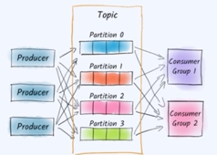
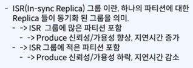

# 카프카 를 사용하는것에 99 프로 이상은 ?

- 토픽을 어떻게
- 어떤 이유로 인해서
- 설정을 하고
- 얼마만큼의 컨슈머를 붙이고
- 운영을 하는지가 제일 중요하다.

### 토픽 이 무었이냐

- 메세지를 발행하고 소비할 수 있는 `객체` (Object) 이다.
    - 컨슈머가 소비해. "무엇" 으로 부터
    - 컨슈머가 발행해. "어디" 에 라는것을 의미하는 객체이다.
- 토픽에 Produce 된 메세지를 Consume 하여 처리한다.

### 토픽 설정이 왜 중요하냐

- 카프카 토픽은 고가용성 고성능을 구현하는 핵심 개념인데
- 토픽에 존재하는 수많은 설정 값든 -> 성능, 가용성에 엄청난 차이를 불러 일으킬 수 있다.
    - 즉, 비즈니스에 따라 Topic 의 설정은 완전히 달라질 수 있다.
    - 카프카 토픽 내에 설정들이 어떤 것을 의미하는지 이해만 할 수 있다면 적절한 Topic 설정이 어떤 것인지 ? `판단` 할 수 있을것이다.

### 토픽의 개념 1 파티션

- 토픽에는 3개의 개념이 있는데 (파티션) 이라는것 이 있다.
- 토픽은 1개 이상의 파티션 들로 이루어 진다.
- 
- 그리고 이 파티션은 하나의 토픽에 포함된 메세지 들을 물리적으로 분리 해서 저장한다.
    - 무슨 말이냐면, 하나의 메세지가 하나의 파티션에 들어가는 형태인데, DB 쪽에서 이야기 하는 파티셔닝 (Partitioning) 이다.

### 토픽의 개념 2 파티션 갯수와 성능

- 파티션 -> 성능과 직결되는 요소이다.
    - 단 브로커가 하나라면, 오히려 성능이 안 나올 수 있다.
- 파티션이 많다는것은, 많은 물리적인 리소스를 활용 가능 하다 라는것이 됨으로 -> 성능이 향상된다 고 볼 수 있다.
- 하나의 파티션은 하나의 브로커에 소속되어 있다.
    - 하나의 Partition (파티션) 은 1개 이상의 Kafka Broker 에 소속되어 있고 (1:1)
    - 하나의 Kafka Broker 는 1개 이상의 Partition (파티션) 을 가지고 있다.

> 하나의 물리적인 Broker 퍼포먼스에는 한계가 있다.
> - 즉, 파티션 갯수가 많다고 해서 브로커가 많다고 볼수 없다.
> - 이것을 결정하려면, 비즈니스에 따라 카프카 브로커 를 몇개 둘것이고, 최적의 파티션의 갯수는 몇개 인지 판단 할 수 있어야 한다.

### 토픽의 개념 3 patition 과 Partition Replica

- 하나의 파티션은 Kafka Cluster 내에 1개 이상의 복제본 (Replica) 를 가질 수 있다
- 하나의 브로커가 문제가 생기거나 무너진다 해도, 클러스터 전체의 입장에서 토픽내에 데이터에 대한 가용성을 높일 수 있는 방법이 RF 패턴이 되는것이다.
- 너무 크면 메세지의 저장 공간을 낭비 할 수 있다.
- Produce 할때에도, 지연 시간이 길어 질 수 있다.

> RF 갯수를 슬기롭게 설정해보자
> - 전체 브로커보다 적게. 설정할것.
> - RF 와 브로커 갯수가 같을때 가장 높은 가용성을 갖는다.
> - 브로커 갯수가 너무 많으면, 복제할때 레이턴시가 걸리거나, 저장공간을 낭비하니 주의하자.

정리

- 토픽안에는 파티션이 있고, 파티션 은 Replication Factor 라는 복제본 이 있다.
- 파티션의 레플리카 (RF) 는 고 가용성을 위한 개념이다.
- 그리고, RF 는 일반적으로 전체 브로커 갯수보다 적어야 의미가 있다.
- 한개 초과된 브로커의 갯수가 있을때에만 RF 를 두는게 의미가 있다.

> 카프카 브로커가 만약 RF 를 100 개면 2개를 하던 100 개를 하던 상관 없다.

### 카프카 토픽의 개념 4 (ISR, In-Sync Replica)

- 메세지를 받는 Topic 에 입장에서, sync 가 되었다고 판단 가능한 레플리카 그룹
- Partition 에 복제 본이 많아지면 (RF 가 커지면) 가용성이 늘어나 !
    - 그리고 Produce 시에도 복제해야할 데이터가 늘어나지 !
- 그렇게 되면 Produce 시에 지연시간이 길어질 수 있어.
    - 그럼에도, 지연시간을 짧게 유지하고 싶으면 ISR 를 두면 되.
      

### Kafka Topic 설계시 유의 해야 할 것들

- 토픽에 포함된 파티션 갯수 (Partition Number) -> Topic 을 사용하기 위한 일꾼들
    - 일반적으로 퍼포먼스와 연관
- 토픽에 포함된 파티션의 복베본 갯수 (RF, Replication Factor) -> Produce 시, 정상적으로 "Replication" 이 되었다.
    - 일반적으로 가용성과 연관이 있어
- 토픽의 ISR 그룹 에 포함된 파티션 그룹 (ISR, In-Sync Replica) -> Replica 들이 정상적으로 Sync 가 되었다.
    - 일반적으로 Produce 시의 지연 시간, 신뢰성과 연관

> 3 가지 개념이 딱딱딱 이루어 지려면 충분한 Kafka Broker 의 갯수와 연관이 있다.
> - 이해해 보려고 하니, 개어렵네 -> 전문 카프카 인력들이 있어야 하고, 운영각 잴라면 이런 인력들이 있어야 한다.

