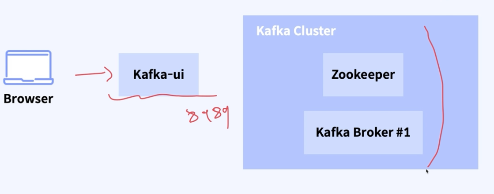
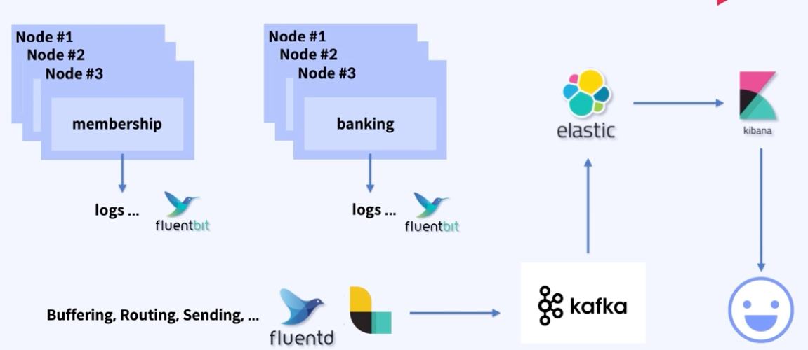

### kafka Produce, Consumer 를 이용해서 인입로그를 구현
- 
- 카프카 프로듀서, 컨슈머를 간단히 구축해 stdout 으로 인입로그를 찍는것을 aspect 를 이용해, 구현했다.

- 원래라면 시간,인증, 파라미터를 찍진 않았다.
- 다만 실습 목전에 맞게만 구현했다.

### 고도화된 파이프 라인은 어떻게 동작해야 할까 ? 

- 그림으로 봤을땐 위와 같아야 한다.
  - 각각의 서버 (서비스) 들이 log 를 차곡차곡 쌓아 놨을텐데
  - 내부에 설치된 fluentD 나 logstash 등 으로 데이터를 보내주게 된다.
  - forward 프로토콜을 사용하게된다
  - 여러 노드들로 부터 다양하게 받아둔 로그들을 필터링 해서 카프카에 보내게되고,
  - elsstic 에서 index 를 잘해줘서 
  - 키바나로 보내주게 된다.

