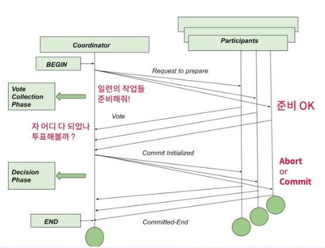

### 2 Phase Commit 
- 처음엔 다수의 노드를 가지는 데이터베이스 에서 커밋을 구현하기 위한 개념으로 시작되었음
- 의미가 확장되어, 분산 시스템 환경에서 트랜잭션을 구현하기 위한 해결 방안 중 하나가 되었다.
- 2 phase commit 은 하나의 약속 규약 ( 프로토콜 ) 이라고 볼수 있다. [ http 같은 프로토콜]
  - 2PC 를 위해서는 분산 시스템 환경에서 Coordinator 라는 별개의 인프라가 필요해
  - 그리고 트랜잭션을 위한 서비스들을 participant 참여자 라고 정의해
    - Prepare (phase 1) 준비
    - commit (phase 2) 커밋
  - 'Coordinator' (조정자): 분산 트랜잭션을 위해 데이터 변경을 수행하는 서버 ( MSA 환경에서 각 서비스 ) 들의 Phase 를 관리한다.

### 2PC 가 구현되는 프로세스

---
--- Start "PrePare" ----
1. 트랜잭션이 시작되면,,, Coordinator (조정자) 가 Global Unique ID ( Transaction ID) 를 생성한다.
2. Coordinator 는 사전에 정의된 각 서비스 별로 실행해야 할 요청들에 대한 준비를 각 서비스에 요청한다. ( 각각의 서비스에 준비좀 해주세요 ~ 라고 요청 )
3. 모든 Participant 가 준비되었다고 응답 받는다. ( 실질적 데이터 변경은 일어나지 않은 상태 이고 각 서비스들에게 준비 됬어요 ~ 라는 응답을 받게 된다.)
--- 
--- "Prepare" Done, "Commit" Start --- 
4. Coordinator 는 Participant 들에게 Commit 요청을 한다.
5. Participant 들은 이전에 준비 했던 동작을 마저 진행 하고, 각 서비 들은 실제 데이터 변경을 위한 Commit 을 진행한다.
6. 모든 Participant 에게 응답을 받게 되면, 트랜잭션 이 완료 된다.
--- 
--- "Commit Done" ---

### 2PC 가 구현되는 프로세스 그림

1. 코디네이터가 각 서비스 참여자 들에게 요청을 함.
2. 참여자 1,2,3 이 존재한다고 가정했을때 1,3 번만 응답을줌
3. 1번과 3번만 참여를 했으니 2번은 누락되었네 ? 그럼 나는 ACID 중에서 I (다른 트랜잭션에 영향을 받으면 안되니, 지금부터 들어오는 준비 요청에 대한 데이터는 처리하지 못하도록 DB Lock 을 걸어야지.)
-> 그래야만 고립성을 만족시킬 테니까
4. 코디네이터 측에서 1,3 번 서비스들아. 모두 Abort 처리 해줘

> 그럼 Coordinator 가 죽어버렸어 얘도 결국 서버거든 .... 이떄는 어떻게 할꺼야 ?   
> 이게 2PC 의 한계이다.  
> 코디네이터에 대한 문제가 생겨버리면, 모든 트랜잭션은 멈춰버리고 모든 비즈니스가 정지된다.  
>  - 코디네이터 의 모든 결정은 취소가 불가능하다.
>    - Commit/ Abort 결정에 대해서는 그 사이에 어떤 문제가 생겼을지라도, 어떤 방법을 써서라도 완료 해야만 한다. -> 트랜잭션의 정합성(일관성)

### 보상 트랜잭션
- 일련의 작업을 보상 ( 보정 ) 하기 위한 트랜잭션을 구현하기 위한 하나의 방법이다.
- 개념 자체는 고전적인 데이터베이스 개념에서 따왔다.
  - Commit 된 데이터를 commit 되기 이전의 상태로 변경하기 위한 작업이다.
  - 데이터베이스 개념상으로는 작업 하던 내용을 다시 Undo (Ctrl + z) 할때 보상 (Compensate) 이라는 용어를 사용한다.

### DBMS 내부적으로 어떠한 작업을 수행한다고 가정.
  - 정상적으로 작업 1 을 실행 (Do)
  - 정상적으로 작업 2 을 실행 (Do)
  - 정상적으로 작업 3 을 실행 (Do)
  - 작업 4 진행 중 문제 발생 (작업 1 ~ 3 까지를 모두 기록)
### 보상 로그 레코드 (CLR, Compensating Log Record)
- 작업 3 을 이전 상태로 복구 (Undo)
- 작업 2 을 이전 상태로 복구 (Undo)
- 작업 1 을 복구하던 중 문제 발생
- ... 복구 이후
- 작업 1 을 이전 상태로 복구 (Undo)

> 보상트랜잭션 이라는 말은 원래 DBMS 쪽에선 일반적인 개념이였고, (이미 구현되어 있는 기능) 
> MSA 가 등장하면서 확장된 개념인 부분이다.

### 결론
- 2 Phase Commit
  - 2 단계 에 걸쳐서 트랜잭션을 구현 (prepare, commit)
  - 한계
    - 코디네이터 에 전적으로 의존해야 하는 한계가 존재
    - 데이터 Lock 으로 인한 가용성의 한계
  - 보상 트랜잭션 (in MSA)
    - 데이터의 변경을 일으키는 요청을 그 이전 상태로 되돌리기 위한 요청 (API)
    - 한계
      - 보상 트랜잭션 요청에 지연 혹은 실패, 문제가 생기는 경우, 보상 트랜잭션을 호출하는 주체는 명확한 판단이 어려움